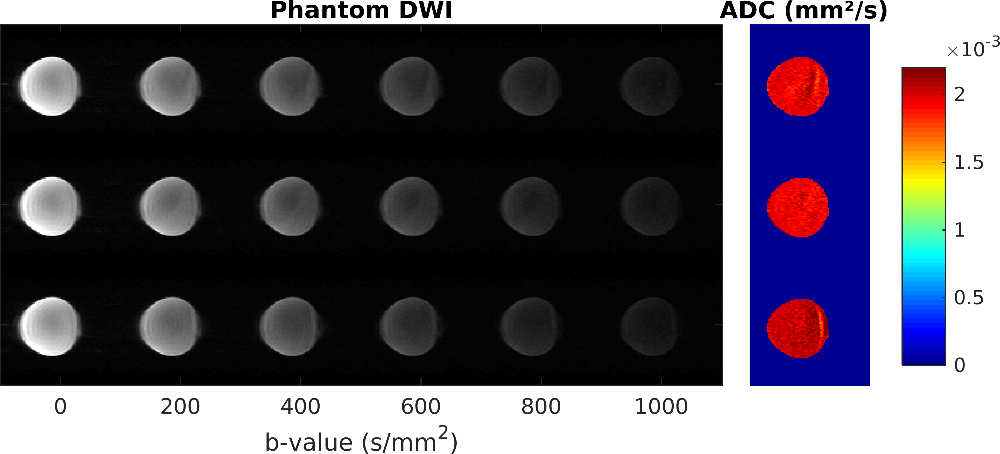
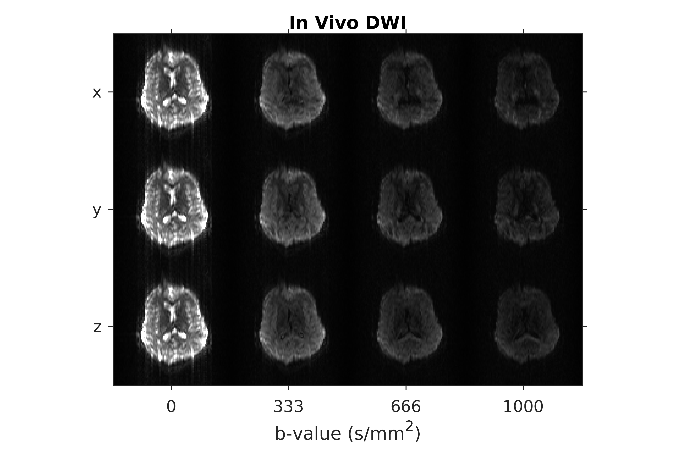
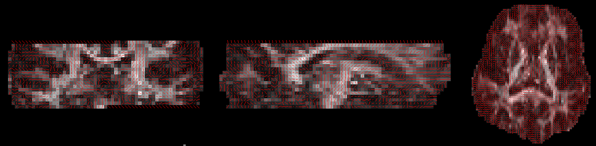

# Summary
Magnetic Resonance Imaging (MRI) acquisitions consist of the sequential application of radio-frequency and magnetic field gradient pulses. Diffusion-Weighted Imaging (DWI) is a widely used type of MRI pulse sequence providing a key image contrast for clinical brain applications such as stroke imaging [@schellinger2010stroke].

Developing new acquisition strategies for DWI acquisition typically requires access to and expertise on the programming environment of the MRI vendor. Pulseq [@layton2017pulseq] is an open source file standard for pulse sequences that enables to deploy the exact same protocol on both Siemens/GE via [TOPPE](https://toppemri.github.io)
[@nielsen2018toppe] and [Bruker](https://github.com/pulseq/bruker_interpreter) platforms, and potentially also on in-house built MRI systems. In this work we introduce `PulseqDiffusion` to enable open-source DWI pulse sequence programming, using PyPulseq [@ravi2019pypulseqjoss; @ravi2018pulseq-gpi], a Python-based implementation of Pulseq [@layton2017pulseq].
We have leveraged this tool for published research works [@nunes2020dwpypulseq; @fernandes2020snr].

# Statement of need
Multiple freely available open-source image processing tools have been developed for DWI such as [MRtrix3](https://www.mrtrix.org/) [@tournier2019mrtrix], [DiPy](www.dipy.org) [@garyfallidis2014dipy], and dedicated tools in [FSL](https://fsl.fmrib.ox.ac.uk/fsl/fslwiki), [@jenkinson2012fsl]. However, vendor-neutral open-source acquisition implementations have not been previously shared.

There has been a growing interest in developing open-source solutions for MRI, aiming to improve its accessibility [www.opensourceimaging.org](www.opensourceimaging.org). `PulseqDiffusion` will allow easier prototyping of DWI sequences and enable cross-vendor comparisons in clinical scanners.
We also expect `PulseqDiffusion` to be a useful starting point for sequence development in the context of accessible low-field stroke imaging [@geethanath2019lowfield].

# About `PulseqDiffusion`
Together with the Python functions required to generate DWI sequences, we provide a tool for simulating the performance of different sequence variants considering a range of hardware solutions [@fernandes2020snr]. This tool predicts the signal-to-noise ratio (SNR) observed for different brain tissues (gray matter, white matter, cerebrospinal fluid - CSF) and the contrast-to-noise ratio (CNR) of an acute stroke lesion relative to those tissues, and can be found in jMRI_Publication_Functions. The implemented code predicts the SNR and CNR per time unit for a spin-echo diffusion-weighted sequence, taking into account the steady-state value for the longitudinal magnetization. For that purpose, we adapted an expression used to predict the SNR per tissue per time unit for a spoiled gradient echo sequence [@marques2019lowfield]. This simulation considers the possibility to use either EPI or spiral readouts and considers the impact of: B0, maximum gradient amplitude, spatial resolution and level of diffusion-weighting (comparing the achieved SNR with that of a typical 1.5T clinical scanner).

We provide Python scripts for generating example diffusion-weighted EPI sequences including single-spin echo preparation (with and without ramp-sampling during signal readout) and a doubly-refocused preparation module [@reese2003tre] as shown below:

The sets of diffusion gradient directions considered for pulse sequence implementation were optimised using [MRtrix3](https://www.mrtrix.org/) [@tournier2019mrtrix].

We provide example data as well as Matlab functions for basic ghost correction and partial Fourier Homodyne reconstruction, as well as image processing. Phantom images reconstructed from the provided example k-space data, including five different levels of diffusion-weighting along three orthogonal directions, as well as the corresponding apparent diffusion coefficient (ADC) maps, are displayed:

Note that the measured ADC value is within the expected value for water at room temperature (2.0x10^{-3} mm^2/s).

For image processing, we employ widely used open-source software tools, including the [matlab toolbox for dealing with Nifti images](https://www.mathworks.com/matlabcentral/fileexchange/8797-tools-for-nifti-and-analyze-image) and [FSL](https://fsl.fmrib.ox.ac.uk/fsl/fslwiki), [@jenkinson2012fsl] for image pre-processing and diffusion tensor estimation. In vivo images reconstructed from the provided k-space data are shown for different levels of diffusion-weighting sampled along three orthogonal directions:

These images and diffusion maps were obtained using the process_data matlab script (ethics approval from the local IRB and written informed consent were obtained prior to scanning). The principal eigenvector estimated for a 12 direction in vivo data set provided as example is shown here:

# Target audience
`PulseqDiffusion` is aimed at MRI researchers focusing on DWI pulse sequence design. We envisage `PulseqDiffusion` to be used for replicability and reproducibility studies (multi-site, multi-vendor). The package could also serve as a hands-on teaching aid for MRI faculty and students. Users can get started with the example pulse sequences and provided phantom and in vivo data.

# Acknowledgements
This study was funded by the Portuguese Foundation for Science and Technology (FCT) under the Indo-Portuguese Programme for Cooperation in Science & Technology, 2017-2019 and grants (UID/EEA/50009/2019 and SFRH/BSAB/150270/2019). Acquisition of example data was funded under the Zuckerman Institute Technical Development Grant for MR, Zuckerman Mind Brain Behavior Institute,Grant Number: CU-ZI-MR-T-0002.

# References
